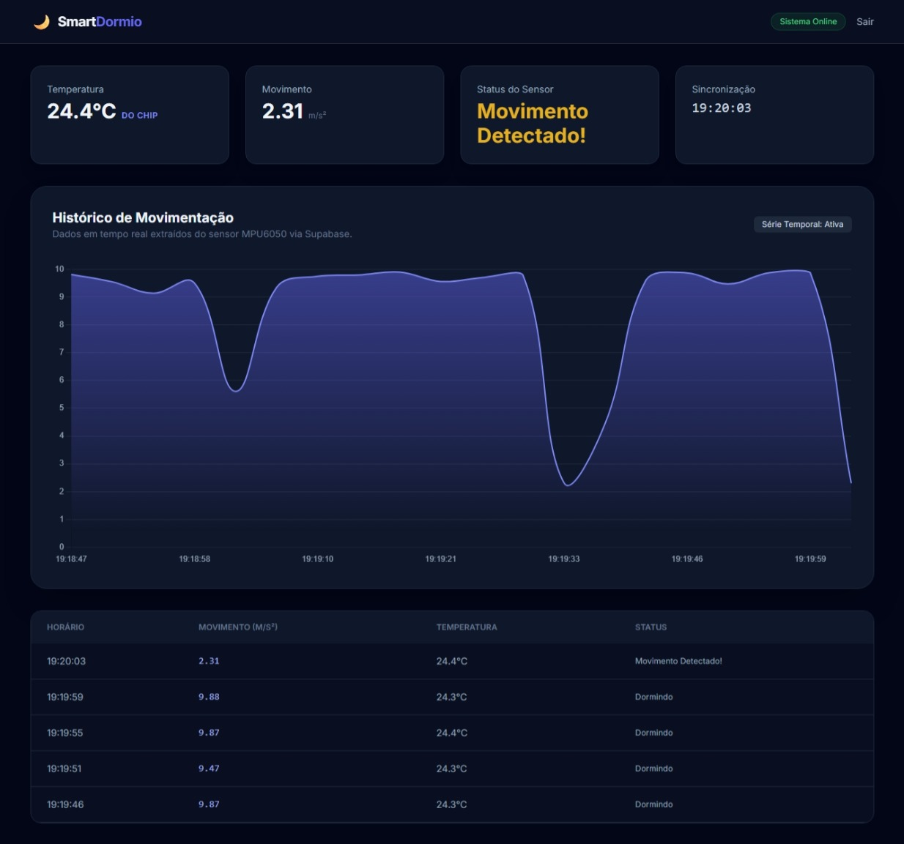

# 🌙 Smart Dormio

[](https://github.com/vitormendes4072/DormioSmart/actions)


Dispositivo embarcado de **baixo consumo** para **detecção não invasiva de movimento durante o sono** — registra **eventos de movimento** no travesseiro, sem contato com o corpo. Trabalho de Conclusão de Curso em Engenharia da Computação (Centro Universitário Senac, 2026).

> **Escopo (honesto):** o projeto registra indícios técnicos de movimento, ancorado em actigrafia. **Não** faz estadiamento de sono (REM/profundo) nem diagnóstico clínico, e **não** substitui polissonografia.

## 🔗 Demo
Dashboard em produção: **https://dormio-smart.vercel.app**

## 🖥️ Dashboard


Visualização do histórico de movimento, com gráfico de série temporal, temperatura do sensor e status (repouso/movimento), atualizada por *polling* na API.

## 🧩 Arquitetura
```
MPU6050 ──I2C──> ESP32 ──HTTPS POST──> API Flask (Vercel) ──> Supabase (PostgreSQL)
                                              │
                                  Dashboard web <── GET /api/sleep-history
```

## 🔌 API
- `POST /api/data` — recebe as leituras do dispositivo e as persiste (ingestão).
- `GET /api/sleep-history` — devolve os registros mais recentes para o dashboard.

## 🗂️ Estrutura
```
firmware/   # C++/Arduino — ESP32 + MPU6050 (simulado no Wokwi na Fase 1)
web-app/    # Flask: API de ingestão, persistência (Supabase) e dashboard
docs/       # METODOLOGIA, HARDWARE, DATASET (fundamentação do TCC)
.github/    # CI (GitHub Actions + pytest)
img/        # diagramas e imagens
hardware/   # (Fase 2) BOM, esquema de ligação e fotos do protótipo físico
ml/         # (Fase 2) validação por dataset público de acelerometria — condicional
vercel.json # configuração de deploy
```

## 🛠️ Stack
**Firmware:** C++ · Arduino · ESP32 · MPU6050 · Wokwi  
**Web-app:** Python 3.11 · Flask · Supabase (PostgreSQL) · Gunicorn · Vercel · Tailwind + Chart.js  
**Qualidade:** pytest · GitHub Actions (CI)

## ▶️ Como rodar (web-app)
```bash
cp web-app/.env.example web-app/.env   # preencha SUPABASE_URL e SUPABASE_SERVICE_ROLE_KEY
pip install -r web-app/requirements.txt
python web-app/app.py                  # http://localhost:5000
# Testes:
cd web-app && python -m pytest tests/ -v
```

### Testar sem hardware
Para exercitar o fluxo completo sem um ESP32, use o simulador Python — ele gera dados do MPU6050 e os envia para a API local (com o app rodando em outro terminal):
```bash
python web-app/fake_sensor.py
```

O firmware é aberto em **firmware/** no [Wokwi](https://wokwi.com) (Fase 1). Ver [`firmware/README.md`](firmware/README.md).

## 📌 Status
- ✅ Web-app no ar — fluxo coleta → armazenamento → visualização funcionando
- ✅ Firmware validado em **simulação** (Wokwi); CI verde
- 🔜 **Fase 2:** protótipo físico no travesseiro (energia, Wake-on-Motion real, validação noturna)
- ⚠️ Não validado clinicamente — projeto acadêmico em desenvolvimento

## 📄 Licença
Projeto acadêmico (Trabalho de Conclusão de Curso). Uso e distribuição conforme as normas do Centro Universitário Senac — para reutilização, consulte os autores.

## 👥 Autores
Arthur Neves Vieira Ponzoni · Vitor Mendes Oliverio
