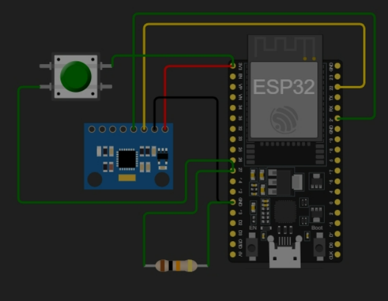

# Firmware — Smart Dormio (ESP32 + MPU6050)

Firmware embarcado que lê o sensor inercial MPU6050, classifica repouso/movimento (limiar simétrico — ver `docs/DATA-CONTRACT.md`), empacota os dados em JSON e os envia para a API web via HTTPS. Na **Fase 1** roda em simulação (Wokwi); na **Fase 2**, na placa física.

## Arquivos
| Arquivo | Função |
|---|---|
| `sketch.ino` | Firmware principal (lógica híbrida simulação/físico) |
| `diagram.json` | Mapeamento do circuito no Wokwi |
| `libraries.txt` | Bibliotecas utilizadas |
| `secrets.example.h` | Modelo de credenciais — **copiar para `secrets.h`** |
| `secrets.h` | Credenciais reais — **ignorado pelo git, nunca versionar** |

## Credenciais (obrigatório antes de compilar)

O firmware não compila sem `secrets.h`. Isso é proposital: melhor falhar o build
do que compilar com credencial escrita no código, que é como segredo acaba no
histórico do git.

```bash
cp firmware/secrets.example.h firmware/secrets.h
# e preencha os três valores
```

| Macro | Fase 1 (Wokwi) | Fase 2 (placa real) |
|---|---|---|
| `WIFI_SSID` | `Wokwi-GUEST` | sua rede |
| `WIFI_PASSWORD` | vazio | sua senha |
| `DEVICE_TOKEN` | token do dispositivo pareado na aplicação | idem |

O **`DEVICE_TOKEN`** é gerado ao parear o dispositivo na aplicação e exibido uma
única vez (SEC-02). Sem ele, `POST /api/data` responde **401** e nada é gravado —
o monitor serial diz exatamente isso quando acontece.

> No Wokwi, `secrets.h` precisa ser criado **dentro do projeto do simulador**
> (aba de arquivos), já que o git não o traz junto. Ao gravar tela para o devlog,
> **não deixe essa aba aberta.**

## Pinagem (Fase 1 — Wokwi)

| Componente | Pino ESP32 | Função |
| :--- | :--- | :--- |
| MPU6050 VCC | 3V3 | Alimentação |
| MPU6050 GND | GND | Referência comum |
| MPU6050 SDA | GPIO 21 | Barramento I2C (dados) |
| MPU6050 SCL | GPIO 22 | Barramento I2C (clock) |
| Botão | 3V3 ↔ GPIO 27 | **Andaime de simulação** — representa o evento de despertar |
| Resistor 10 kΩ | GPIO 27 ↔ GND | Pull-down do botão (garante LOW estável durante o sono) |

O **GPIO 27** foi escolhido por pertencer ao domínio RTC (RTC_GPIO17), requisito para o despertar por EXT1 a partir do Deep Sleep, e por ser isolado dos pinos de *bootstrapping*.

> **Botão e resistor são andaime de simulação** (Fase 1). No dispositivo físico (Fase 2), o despertar passa a vir da interrupção do próprio MPU6050 — ver `docs/HARDWARE.md`.



## Lógica híbrida (simulação × físico)

O Wokwi tem limitações: não emula o Deep Sleep nativo do ESP32 (o `esp_deep_sleep_start()` com I2C ativo causa reset) nem o pino de interrupção (INT) do MPU6050. Para contornar, o firmware usa uma flag de compilação:

```cpp
// true  = validar a lógica no Wokwi (evita o crash do simulador)
// false = gravar na placa ESP32 real
#define MODO_SIMULADOR true
```

- **`true` (Simulação):** o sono é "mockado" — o código monitora o botão e faz um *soft reset* (`ESP.restart()`) ao detectar o clique, emulando o despertar.
- **`false` (Físico — Fase 2):** usa `esp_deep_sleep_start()` com despertar por máscara de bits **EXT1**. A substituição do botão pela **interrupção real do MPU6050 (Wake-on-Motion)** é alvo da Fase 2 e ainda não está implementada.

## Baixo consumo (nota honesta)

O **núcleo** do ESP32 suporta Deep Sleep da ordem de microampères. A placa **DevKit V1**, porém, mantém regulador de tensão e conversor USB-serial alimentados, elevando o consumo de repouso para a ordem de miliampères. O consumo real será **medido no protótipo** na Fase 2; a avaliação de uma placa de menor consumo faz parte dessa etapa (ver `docs/HARDWARE.md` e `docs/METODOLOGIA.md`).

## Como rodar (Wokwi)

1. Abra a pasta `firmware/` no [Wokwi](https://wokwi.com).
2. Crie o arquivo `secrets.h` no projeto (ver "Credenciais" acima).
3. Mantenha `#define MODO_SIMULADOR true`.
4. Inicie a simulação; o console exibe o ciclo de leitura e o estado de repouso.
5. Clique no botão do diagrama para emular o despertar por movimento.
