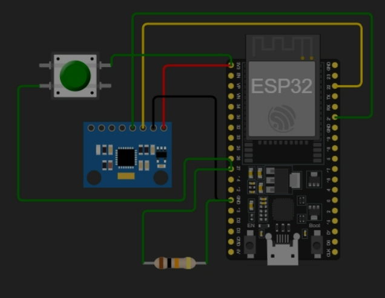

# 🌙 Smart Dormio: Monitor de Sono IoT de Baixo Consumo


> **Projeto de Engenharia de Computação (TCC) - 2026**
> Desenvolvimento de um sistema de monitoramento de sono focado em eficiência energética (Deep Sleep) e despertar por interrupção externa (Wake-on-Motion).

---

## 📖 Sobre o Projeto

O **Smart Dormio** é um dispositivo IoT projetado para monitorar a qualidade do sono detectando movimentos através de um acelerômetro **MPU6050**. O diferencial técnico deste projeto reside na arquitetura de software desenvolvida para operar em ambientes de simulação limitados (**Wokwi**) e, simultaneamente, em hardware real, sem necessidade de reescrever o código lógico.

O sistema demonstra o uso avançado do modo **Deep Sleep** do ESP32, reduzindo o consumo de corrente para a ordem de microampères (µA) até que um evento físico (movimento) o desperte.

---

## ⚙️ Arquitetura de Hardware

Para garantir a estabilidade do sistema e evitar despertares falsos causados por ruído eletromagnético (pinos flutuantes), o projeto utiliza uma topologia com **Resistor de Pull-Down Físico**.

### Diagrama de Conexões (Pinout)

A escolha do **GPIO 27** é estratégica, pois este pino pertence ao domínio RTC (RTC_GPIO17) e é isolado de funções de *bootstrapping* (como o GPIO 13), garantindo um despertar limpo.

| Componente | Pino ESP32 | Função Técnica |
| :--- | :--- | :--- |
| **MPU6050 VCC** | 3V3 | Alimentação |
| **MPU6050 GND** | GND | Referência Comum |
| **MPU6050 SDA** | GPIO 21 | Barramento I2C (Dados) |
| **MPU6050 SCL** | GPIO 22 | Barramento I2C (Clock) |
| **Botão (Lado A)** | 3V3 | Sinal de Interrupção (HIGH) |
| **Botão (Lado B)** | GPIO 27 | Pino de Despertar (Wake-up Source) |
| **Resistor 10kΩ** | GPIO 27 ↔ GND | **Pull-Down Físico:** Garante LOW estável durante o sono |

### Esquemático Visual


---

## ⚠️ Desafio Técnico e Solução de Engenharia

Durante o desenvolvimento no simulador Wokwi, identificou-se uma limitação crítica no kernel de emulação.

### O Problema: Crash no Deep Sleep
Ao executar o comando `esp_deep_sleep_start()` com a biblioteca I2C ativa, o simulador entra em colapso e reinicia o microcontrolador com o código de erro `rst:0x1 (POWERON_RESET)` em vez de entrar em suspensão. Além disso, o sensor MPU6050 virtual não simula o pino de interrupção (INT).

### A Solução: Arquitetura Híbrida (Mocking)
Foi desenvolvida uma camada de abstração de hardware controlada via software. Uma flag de pré-processamento define como o ESP32 deve se comportar ao "dormir":

1.  **Modo Simulação (`true`):** Implementa um *Mock* (simulação) do sono. O código entra em um loop infinito (travando o processamento) e monitora o botão manualmente. Ao detectar o clique, executa um *Soft Reset* (`ESP.restart()`), emulando visualmente o despertar.
2.  **Modo Produção (`false`):** Compila as instruções reais de baixo nível. Utiliza `esp_deep_sleep_start()` e configura o despertar via máscara de bits **EXT1**, ideal para o hardware físico.

---

## 🚀 Como Utilizar (Guia de Replicação)

### 1. Pré-requisitos
Instale as seguintes bibliotecas no seu ambiente (Arduino IDE / PlatformIO):
* `Adafruit MPU6050`
* `Adafruit Unified Sensor`
* `Adafruit BusIO`

### 2. Configuração do Código
No arquivo principal (`sketch.ino` ou `main.cpp`), localize a linha de configuração mestra no topo:

```cpp
// ALTERNE AQUI CONFORME O AMBIENTE:
// true  = Para validar lógica no Wokwi (Evita Crash)
// false = Para gravar na placa ESP32 real (Economia de Bateria)
#define MODO_SIMULADOR true
````

## 3. Executando a Simulação (Wokwi)

Mantenha `#define MODO_SIMULADOR true`.

Inicie a simulação.

O console exibirá `Zzz... Entrando em MODO SLEEP` e o log irá parar.

Clique no botão físico no diagrama.

O sistema reiniciará exibindo `>>> WOKWI: BOTAO DETECTADO! <<<`.

---

## 4. Gravando no Hardware Real

Altere para `#define MODO_SIMULADOR false`.

Faça o upload para a placa.

O sistema entrará em Deep Sleep verdadeiro.

Ao pressionar o botão, o ESP32 acordará mantendo o contexto RTC e exibirá `>>> HARDWARE REAL: ACORDEI PELO BOTAO! <<<`.

---

## 📂 Estrutura do Repositório

```plaintext
/
├── src/
│   └── sketch.ino       # Firmware principal (Lógica Híbrida)
├── img/
│   └── circuito.png     # Esquemático de conexões
├── diagram.json         # Arquivo de mapeamento do Wokwi
├── README.md            # Documentação do projeto
└── LICENSE              # Licença de uso

